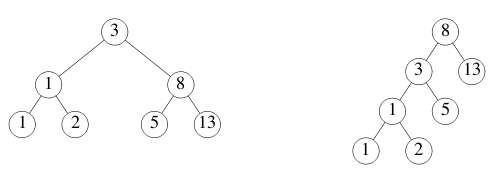

### Exercise: Equivalent Binary Trees
There can be many different binary trees with the same sequence of values stored at the leaves. For example, here are two binary trees storing the sequence 1, 1, 2, 3, 5, 8, 13.



A function to check whether two binary trees store the same sequence is quite complex in most languages. We'll use Go's concurrency and channels to write a simple solution.

This example uses the tree package, which defines the type:
```cassandraql
type Tree struct {
    Left  *Tree
    Value int
    Right *Tree
}
```

Continue description on [next page](equivalent-binary-trees.go).